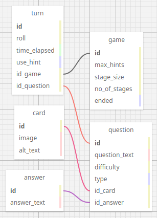

# Data

## Gameplay

### Game
- max_hints: `int` or `null`
- stage_size: `int`
- no_of_stages: `int`
- ended: `bool`

### Turn
- roll: `int` or `null`
- time_elapsed: `time`
- use_hint: `bool`
- id_game: `int:fk`
- id_card: `int:fk`

### Card
- difficulty: `int`
- question_text: `text`
- image: `text\url\blob``
- type: `enum`
- id_answer: `int:fk

### Answer
- question_type: `enum`
- id_card: `int:fk`

### Diagram
